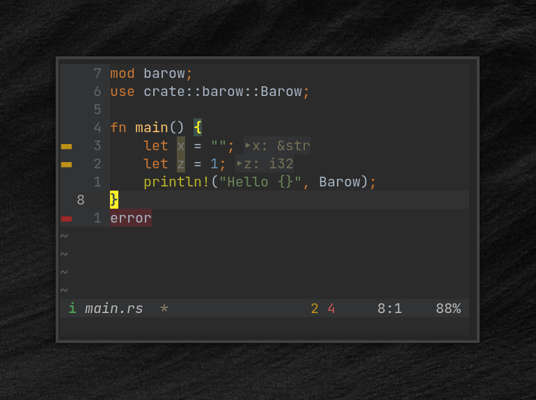

## MINLINE



A minimalist statusline for [n](https://neovim.io/)/[vim](https://www.vim.org/).

### install
If you use a plugin manager, follow the traditional way.

For example with [vim-plug](https://github.com/junegunn/vim-plug) add this in `.vimrc`/`init.vim`:
```
Plug 'devoc09/minline'
```

Inspired by [doums/barow](https://github.com/doums/barow)
